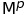
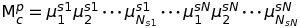
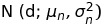
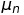
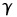

# INTERSPEECH 2018 submission 01
Language-independent and duration-informed solo singing voice phoneme segmentation by jointly learning syllable and phoneme onset positions.

The code in the repository is for the conference review process.

For the demo of the algorithm, please check the [distribute branch](https://github.com/ronggong/interspeech2018_submission01/tree/distribute).

## A Paper complementary information

### A.1 Results example

An illustration of the result for a testing singing phrase. 
* The red and black vertical lines are respectively the syllable and phoneme onset positions 
(1st row: ground truth, 2nd and 3rd rows: proposed method detections, 
4th row: baseline method detections). 
* The blue curves in the 2nd and 3rd 
row are respectively the syllable and phoneme ODFs. 
* The 4th row shows the syllable/phoneme labels on the y axis, emission probabilities matrix at the background
and alignment path by the blue staircase line.

### A.2 Annotation units for phoneme-level

1. This table shows the annotation units used in 'pinyin', 'dianSilence' and 'details' tiers of each Praat TextGrid.

2. Chinese pinyin and X-SAMPA format are given. 

3. b,p,d,t,k,j,q,x,zh,ch,sh,z,c,s initials are grouped into one representation (not a formal X-SAMPA symbol): c  

4. v,N,J (X-SAMPA) are three special pronunciations which do not exist in pinyin.

<dl>
<table>
  <tr>
    <th></th>
    <th>Structure</th>
    <th>Pinyin[X-SAMPA]</th>
  </tr>
  <tr>
    <td rowspan="2">head</td>
    <td>initials</td>
    <td>m[m], f[f], n[n], l[l], g[k], h[x], r[r\'], y[j], w[w], {b, p, d, t, k, j, q, x, zh, ch, sh, z, c, s} - group [c] [v], [N], [J] - special pronunciations</td>
  </tr>
  <tr>
    <td>medial vowels</td>
    <td>i[i], u[u], ü[y]</td>
  </tr>
  <tr>
    <td rowspan="4">belly</td>
    <td>simple finals</td>
    <td>a[a"], o[O], e[7], ê[E], i[i], u[u], ü[y], i (zhi,chi,shi) [1], i (ci,ci,si) [M],</td>
  </tr>
  <tr>
    <td>compound finals</td>
    <td>ai[aI^], ei[eI^], ao[AU^], ou[oU^]</td>
  </tr>
  <tr>
    <td>nasal finals</td>
    <td>an[an], en[@n], in[in], ang[AN], eng[7N], ing[iN], ong[UN]</td>
  </tr>
  <tr>
    <td>retroflexed finals</td>
    <td>er [@][r\']</td>
  </tr>
  <tr>
    <td>tail</td>
    <td></td>
    <td>i[i], u[u], n[n], ng[N]</td>
  </tr>
</table>
</dl>

### A.3 Baseline forced alignment details

The baseline is a 1-state monophone DNN/HSMM model. We use monophone model 
because (i) our small dataset doesn't have enough phoneme instances for exploring 
the context-dependent triphones model, and (ii) Brognaux and Drugman[1]
 and Pakoci et al.[2] argued that context-dependent model 
 can't bring significant alignment improvement. It is convenient to apply 1-state 
 model because each phoneme can be represented by a semi-Markovian state carrying 
 a state occupancy time distribution. The audio preprocessing step is the same as 
 in the paper section 3.1.

**Discriminative acoustic model**: We use a CNN with softmax outputs 
as the discriminative acoustic model. According to the work of 
Renals et al.[3], a neural network with softmax 
outputs trained for framewise phoneme classification outputs the 
posterior probability p(q|x) (q: state, x: observation), 
which can be approximated as the acoustic model at the frame-level 
if we assume equal phoneme class priors. In our previous work, 
a one-layer CNN with multi-filter shapes has been designed. 
It has been experimentally proved that this architecture can successfully 
learn timbral characteristics and outperformed some deeper CNN architectures 
in the phoneme classification task for a small jingju 
singing dataset[4]. Thus, we use this one-layer 
CNN acoustic model for the baseline method. The same 
log-mel context introduced in section 3.1 is used as 
the model input and its phoneme class as the target label. 
The model predicts the phoneme class posterior probability for each context.

**Coarse duration and state occupancy distribution**: 
The baseline method receives the phoneme durations of 
teacher's singing phrase as the prior input. The phoneme durations are stored 
in a collapsed version of the  array 
(section 3.2.1): 

The silences are treated separately and have their independent durations.

The state occupancy is the time duration that the student sings on 
a certain phoneme state. It is expected to be the same duration as 
in the teacher's singing. We build the state occupancy distribution as a Gaussian, 
which has the same form  as 
in section 3.2.1, where  indicates in this context 
the nth phoneme duration of the teacher's singing. 
We set  empirically to 0.2 as we found this value works well 
in our preliminary experiment.

**HSMM for phoneme boundaries and labels inference**: 
We construct an HSMM for phoneme segment inference. 
The topology is a left-to-right semi-Markov chain, 
where the states represent the phonemes of the teacher's singing phrase sequentially. 
As we are dealing with the forced alignment, 
we constraint that the inference can only be started by the leftmost state and 
terminated to the rightmost state. The self-transition probabilities 
are set to 0 because the state occupancy depends on the predefined distribution. 
Other transitions - from current states to subsequent states are set to 1. 
The inference goal is to find best state sequence, and we use 
Guédon's HSMM Viterbi algorithm[5] for this purpose. 
The implementation code can be found in the path `lyricsRecognizer`. 
Finally, the segments are labeled by the alignment path, 
and the phoneme onsets are taken on the state transition time positions.

### A.4 Phoneme and syllable onset detection results
We trained both proposed and baseline models 5 times with different random seeds. The mean and the std are reported.
#### A.4.1 Proposed method

|           | Phoneme (mean, std) | Syllable (mean, std) |
|-----------|---------------------|----------------------|
| Precision | 75.73, 0.60         | 76.05, 0.41          |
| Recall    | 74.77, 0.60         | 75.59, 0.40          |
| F1        | 75.25, 0.60         | 75.82, 0.40          |

#### A.4.2 Baseline method

|           | Phoneme (mean, std) | Syllable (mean, std) |
|-----------|---------------------|----------------------|
| Precision | 42.92, 0.89         | 41.16, 1.02          |
| Recall    | 46.18, 0.96         | 40.91, 1.02          |
| F1        | 44.49, 0.92         | 41.04, 1.02          |

## B Code usage
### B.1 First thing to do
* Use python 2.7.* I haven't test the code on python3  
* Install the requirements.txt

### B.2 Download 3 jingju solo singing voice datasets
[part 1](https://doi.org/10.5281/zenodo.780559)  
[part 2](https://doi.org/10.5281/zenodo.842229)  
[part 3](https://doi.org/10.5281/zenodo.1185123)  
If you only want to reproduce the experiment results in the paper, 
you only need to download the part 3 because the part 1 and 2 are used
for training the models.

### B.3 Set the paths
Once datasets are downloaded, you need to set the paths to let the 
program knows where are they. 
#### B.3.1 Set the datasets path
What you need to set in `./general/filePathShared.py` are:
* Set `path_jingju_dataset` to the parent path of these three datasets.
* Set `primarySchool_dataset_root_path` to the path of the interspeech2018 dataset (for reproducing the experiments).
* Set `nacta_dataset_root_path` to the path of the jingju dataset part1 (for training the models).
* Set `nacta2017_dataset_root_path` to the path the jingju dataset part2 (for training the models).
#### B.3.2 Set the training data path
And in both `./general/filePathHsmm.py` and `./general/filePathJoint.py`:
* Set `training_data_joint_path` to where putting the training features, labels
for the proposed joint model. (for training the models)
* Set `training_data_hsmm_path` to where putting these files for the baseline
HSMM emission model. (for training the models)

### B.4 How to use pre-trained models to reproduce the results?
As you may see, there is a _cnnModels_ folder in the repo, where we store all
the pre-trained models. To use these models, you should run the following scripts:
* `proposed_method_pipeline.py` will calculate the syllable and phoneme onset
results using the proposed method, then save them to `./eval/results/joint/`.
* `baseline_forced_alignment.py` will calculate those results using the baseline
 HSMM forced alignment, then save them to `./eval/results/hsmm/`.

For each model, we have trained five times, to get the mean and std statistics, you
need to run `eval_stats.py`. The final results will be put in `./eval/hsmm/` or 
`./eval/joint/` folds.
* _*phoneme_onset_all.txt_: phoneme onset detection results
* _*phoneme_segment_all.txt_: phoneme segmentation results
* _*syllable_onset_all.txt_: syllable onset detection results
* _*syllalbe_segment_all.txt_: syllable segmentation results

There are two columns in each result file, the 1st column is the mean, the 2nd
is the std. For onset detection results, the 3rd row is the f1-measure
without considering the label and the tolerance is 0.025s.

### B.5 How to get the features, labels and samples weights?
Make sure that you have downloaded all three datasets and set the `training_data_joint_path`
and `training_data_hsmm_path`. In `./training_feature_collection` folder, you can:
* Run `training_sample_collection_joint.py` for the proposed method
* Run `training_sample_collection_hsmm.py` for the baseline method

The training materials will be stored in the paths you have set.

### B.6 How to train the models?
We have provided the training scripts. You can find them in `./model_training/train_scripts` folder.
Before running them, you need change the necessary paths (check B.3.2) to direct to the training materials
which you obtained in the previous step.

## Questions?
Feel free to open an issue or email me: rong.gong\<at\>upf.edu

## References
* [1] S. Brognaux and T. Drugman, "HMM-Based Speech Segmentation: Improvements of Fully Automatic Approaches," in IEEE/ACM Transactions on Audio, Speech, and Language Processing, vol. 24, no. 1, pp. 5-15, Jan. 2016.
doi: 10.1109/TASLP.2015.2456421
* [2] Pakoci E., Popović B., Jakovljević N., Pekar D., Yassa F. (2016) A Phonetic Segmentation Procedure Based on Hidden Markov Models. In: Ronzhin A., Potapova R., Németh G. (eds) Speech and Computer. SPECOM 2016. Lecture Notes in Computer Science, vol 9811. Springer,
* [3] S. Renals, N. Morgan, H. Bourlard, M. Cohen and H. Franco, "Connectionist probability estimators in HMM speech recognition," in IEEE Transactions on Speech and Audio Processing, vol. 2, no. 1, pp. 161-174, Jan. 1994.
doi: 10.1109/89.260359
* [4] Pons, J., Slizovskaia, O., Gong, R., Gómez, E., & Serra, X. (2017, August). Timbre analysis of music audio signals with convolutional neural networks. In Signal Processing Conference (EUSIPCO), 2017 25th European (pp. 2744-2748)
* [5] Guédon, Y., 2007. Exploring the state sequence space for hidden Markov and semi-Markov chains. Computational Statistics & Data Analysis, 51(5), pp.2379-2409.